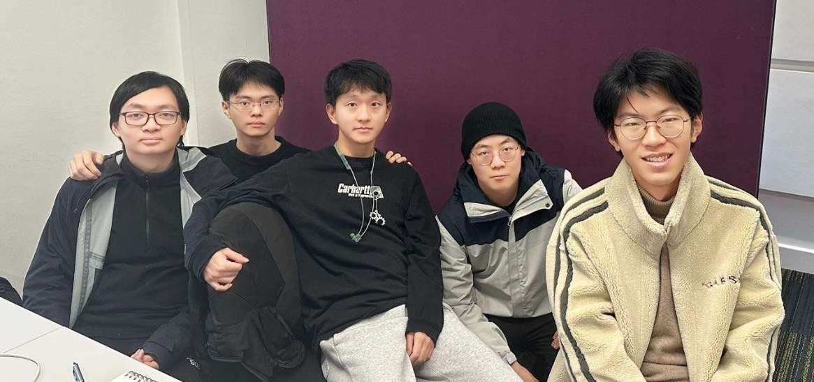

# 2025-group-18

## 🚢🌊♻️ - Sink or Pollute

[🖱️ Game Demo](https://uob-comsm0166.github.io/2025-group-18/)

Video of Demo - TBD

    <video src="https://github.com/user-attachments/assets/f20b9884-b72e-4ccb-a19a-69b9ebbc92a4" controls width="600"></video>

>  [!IMPORTANT] 
> 
> Our team previously developed and modified code in this [📦 GitHub repository](https://github.com/qtyohh/Plan-Roguelike-Knight)

## 👥 Our Group

| 🙋‍♂️ Name    | 📧 Email              | 💻 GithubID   | 🛠️ Role | ✅ Completed Work |
|:-------------:|:---------------------:|:-------------:|:--------:|:----------------:|
| Tianyu Qi     | yn24649@bristol.ac.uk | qtyohh        | TBD      | TBD              |
| Likun Liang   | oy24839@bristol.ac.uk | lycorisadiata | TBD      | TBD              |
| Yutong Liu    | xm24685@bristol.ac.uk | WILLOW579     | TBD      | TBD              |
| Zihao Xia     | qh24613@bristol.ac.uk | WeirdDruid    | TBD      | TBD              |
| Guanglong Xia | iu24606@bristol.ac.uk | X-Theodore    | TBD      | TBD              |

## Kanban link

> [🧩 Board · 2025-Group-18](https://github.com/orgs/UoB-COMSM0166/projects/129)

## Weekly work

### Week 01

1. [📊 Research game](docs/labprocess/week01/research-game.xlsx)
2. [📝 A list of inspiration (including game mechanics)](docs/labprocess/week01/Game-mechanics-example.docx)
3. [📝 Game ideas](docs/labprocess/week01/Inspiration-of-Knight.docx)

### Week 02

1. [🖱️ Paint Work](https://uoB-COMSM0166.github.io/2025-group-18/labprocess/week02/paint/)
2. [📜 Two game ideas](docs/labprocess/week02/Two-Game-Ideas.md)

### Week 03

1. [🎥 Paper Prototype](docs/labprocess/week03/idea2.mp4)
   
   

      <video src="https://github.com/user-attachments/assets/f10a8343-5c8b-4841-b726-3268efc43926" controls width="600"></video>
    

2. <a href="docs/labprocess/week03/DigitalWireframe.gif" target="_blank">🎞️ Digital wireframe</a>

3. [📜 Additional requirements](docs/labprocess/week03/AdditionalRequirements.md)

### Week 04

1. [📜 Requirements section](docs/labprocess/week04/Epic.md)
2. [📜 Feedback section](docs/labprocess/week04/Feedback.md)
3. [🧩 Onion Model of Stakeholders](docs/labprocess/week04/Onion%20Model%20of%20Stakeholders.png)

### Week 05

1. [🧩 Class Diagram](docs/labprocess/week05/ClassDiagram.png)
2. [🧩 Sequence Diagram](docs/labprocess/week05/SequenceDiagram.png)

### Week 06 (Reading week - nothing need)

### Week 07

1. [📊 Heuristic Evaluation](docs/labprocess/week07/heuristic-evaluation.md)

### Week 08

1. [📜 Three Challenges](docs/labprocess/week08/three-challenges.md)
2. [📊 User Evaluations (SUS & NASA-TLX)](docs/labprocess/week08/user-evaluations.md)

## Project Report

### Introduction

- Game background
  
  - In the early 22nd century, tech changes and science made pollution worse. Climate change caused sea levels to rise, and land became very little. Lack of resources and bad environment made problems worse. Humans had to fight pollution monsters and look for survival resources in ocean storms.

- Game  mechanics
  
  - This game has a highly replayable roguelike core loop. Every run gives new strategy choices. Key features include randomly generated levels, many random events, weapon and skill combos, growing difficulty, and a reward-punishment system. Each run brings new challenges and chances.
  - Players go through a loop of "start - explore - fight - choose - die/win - move on/restart." They get stronger, unlock new stuff, and explore more strategies. The game aims to give intense battles and make players feel fun and achievement through trying and growing.

- Game innovation:
  
  - A roguelike shooting survival game where every play is different. Players fight, survive, and plan in random environments. The game offers many weapon, skill, and pet combos, plus resource collecting and upgrades to grow stronger in tough battles.
  - A dynamic weather system changes the gameplay. Big storms can change your route, ocean currents affect your speed, and strange sea events bring new threats. Players must adapt to harsh weather and change tactics to survive and fight well.
  - A pollution system changes with player and enemy actions. It affects the ecosystem, resources, and enemy power. High pollution can cause mutant creatures, lower resources, and speed up ocean decay. Lowering pollution can unlock tech upgrades and ally support. Players can clean the environment for long-term gains or use the chaos from pollution as a tactic.

---

### Requirements

#### Identifying Stakeholders

    

#### Epic

| Bot                       | User Story                                                                                                                                                                                                                                                        | Acceptance Criteria                                                                                                                                                                                                                                                                                                                                                                                                            |
| ------------------------- | ----------------------------------------------------------------------------------------------------------------------------------------------------------------------------------------------------------------------------------------------------------------- | ------------------------------------------------------------------------------------------------------------------------------------------------------------------------------------------------------------------------------------------------------------------------------------------------------------------------------------------------------------------------------------------------------------------------------ |
| Action Shooter Enthusiast | As an action shooter game enthusiast, I have a lot of time recently, but most action shooters are too repetitive. I want to play a game that includes more randomness.                                                                                            | 1. Enemies, weapons, and battlefields are randomly generated in each session.   2. The difficulty of the game and the types of enemies dynamically adjust based on player progress.   3. The game has multiple random event triggers.   4. Players experience a different gameplay process each time.   5. There is a random mode where players can choose different challenges.                                   |
| Rogue-like Enthusiast     | As a roguelike game enthusiast, I've played many roguelike games, but few of them incorporate battlefield changes as part of the strategy. I want to play a roguelike game that includes battlefield changes as part of the strategy.                             | 1. The battlefield changes dynamically based on game progress or player choices.   2. The battlefield changes affect player’s tactical decisions.   3. Players can alter the battlefield with specific skills or items.   4. Changing the battlefield requires players to weigh strategy and resource management.   5. Impact of battlefield changes is clearly communicated in the game.                          |
| Casual Gamer              | As a casual gamer, I’ve always wanted to try roguelike games, but the learning curve of games like *The Binding of Isaac* and *Slay the Spire* is too steep for me. I want the ability to customize the game difficulty so I can choose based on my gaming level. | 1. The game offers multiple difficulty settings.   2. The game includes tutorials to help new players understand the basic gameplay.   3. The game provides progressively unlocked difficulty options.   4. At lower difficulties, enemy attack strength and numbers are reduced.   5. The game provides clear progress tracking and feedback.                                                                     |
| Game Auditor              | As a game auditor, I want the game to have a wider audience, so I need to minimize graphic violence.                                                                                                                                                              | 1. The game avoids excessive graphic violence, including bloody or gory scenes.   2. Combat effects can be represented through non-lethal means.   3. The game’s content complies with age classification standards.   4. The game avoids using vulgar language or visual effects.   5. If necessary, the game provides adjustable violence levels.                                                                |
| Colorblind Player         | As a colorblind player, I often find it difficult to distinguish between characters, items, etc., in fast-paced action games. I hope the game features elements with clear visual effects, such as different colored outlines.                                    | 1. Each character, item, enemy, and other elements have clearly distinguishable marks (colored borders).   2. The game offers colorblind modes or customizable color options.   3. UI elements are designed with colorblind players in mind.   4. Environmental and combat elements are differentiated through shapes, textures, and other features.   5. The game offers visual effect options to adjust markers. |

#### Early stages design

- Player Units:
  1. **Player Status:** HP, cooldown (for skills), buffs, attack power, damage bonus, move speed, pollution level
  2. **Weapons:** Type (melee, ranged), stats (blast radius, range, etc.)
  3. **Skills:** Single-target or area attack, cooldown, effect, skill upgrades (like number changes)
  4. **Equipment:** Type (armor, accessories), stats, effects, quantity limits (like consumables)
  5. **Summons:** Type (normal turret, laser turret, etc.), number, position, AI behavior, stats (HP, attack power)
- Enemy Units:
  1. **Enemy Status:** Type (normal, boss), HP, buffs, stats (damage, armor, etc.)
  2. **Weapons:** Types, stats (damage, range)
  3. **Skills(boss):** Unique skill sets, AI-controlled use (attacks, special moves)
  4. **Equipment:** Affects behavior or power (e.g., more armor, stronger attacks)
  5. **Special Cases:** Spawn location, power changes with progress, unique behavior (e.g., retreat when low HP)
- Neutral Units:
  1. **Interaction:** Players can interact (e.g., trading, quest giving, combat)
  2. **Other Functions:** Environmental impact (e.g., triggering events), NPC behaviors (e.g., healing, providing information)
- Environment:
  1. **Destructible Objects:** Interactive barriers, traps, walls that can be destroyed or altered by players (using weapons or skills)
  2. **Indestructible Objects:** Static obstacles that remain throughout gameplay (e.g., terrain, background scenery)
- User Interface & Interaction:
  1. **Reward System:** Rewards are given based on how well players do (like fighting skills, finishing quests). As players go further, rewards get better (like stronger items).
  2. **Other Interactive Elements:** Shops (use game money to buy stuff), Dialogue (choices matter), Events with decisions (moral or combat-related choices).
- Randomization & Procedural Elements:
  1. **Enemies:** Randomly picked from enemy types or preset boss list based on how far the player has progressed
  2. **Weapon Acquisition:** Enemies drop weapons randomly; similar weapons drop more often as you go further; better gear unlocks in stages
  3. **Attribute/Buff Enhancements:** Random or tier-based system (weak buffs early, strong buffs later)
  4. **Random Events:** Many types (like ambushes or discoveries); no back-to-back repeats; some events only happen after certain things are done

#### The process of development and ideation

- At first, we planned to make a roguelike dungeon game, inspired by classics like *The Binding of Isaac* and *Soul Knight*. Based on that, we designed the main parts of the game and made early sketches to show the structure and art style (see below).

- But later, through team talks and trying things out, we found our game wasn’t new or fun enough. So we had several discussions to find ways to improve it, and finally chose to change the game’s setting and mechanics. After thinking it through, we moved the game to the open sea, letting players go on an ocean adventure in unknown waters.
  
  With this new idea, we updated the game’s early design, including ship models from different angles, concept art for the environment, and new gameplay systems (see below). This change gave our game a more unique theme and more creative space to build on.

<b>Player-Ship Design</b>

| **Vessel**                                                    | **Terrain**                                                        | **Multi-view**                                                |
| ------------------------------------------------------------- | ------------------------------------------------------------------ | ------------------------------------------------------------- |
|  |  |  |

<b>Environment Design</b>

<b>Game GIF Design</b>

| Name           | Preview                                                         | Type     | Description |
| -------------- | --------------------------------------------------------------- | -------- | ----------- |
| Boss1          |           | boss     | boss1       |
| Boss2          |           | boss     | boss2       |
| Enemy1         |          | enemy    | enemy1      |
| Enemy2         |          | enemy    | enemy2      |
| Enemy3         |          | enemy    | enemy3      |
| Enemy4         |          | enemy    | enemy4      |
| Bird           |             | orbiter  | orbiter     |
| Pollute-bucket |  | building | pollution   |
| Tnt            |             | building | tnt         |

---

### Design

- 15% ~750 words 
- System architecture. Class diagrams, behavioural diagrams. 

> [!WARNING]
> 
> system architecture ? 

#### Class Diagram

#### Sequence Diagram

---

### Implementation

- 15% ~750 words (Describe implementation of your game, in particular highlighting the three areas of challenge in developing your game.)

> [!IMPORTANT]
> 
> **Challenge** 全局缩放? 延迟卡顿? (这个我放在第四点了, 你们看看前三条和这个)

#### Our implementation

Our system is mainly divided into five parts: PlayerControl, Status, Object, Buffs, and UI.

- **PlayerControl** part manages player actions, including movement, hit feedback, and skills.
- **Status** is used to store and call player data.
- **Object** defines all in-game entities, which are divided into LivingObject and StillObject, covering player classes, enemy classes, building classes, and more.
- **Buffs** manages the creation, application, and removal of all buffs in the game.
- **UI** part builds the entire visual layout, including StartUI, MapUI, InGameUI, and 16 other UI designs.

#### Challenge

1. **Dynamic Pollution System**
    **Description:**
    A key mechanic in our game is the pollution system, which affects enemy strength, available resources, and environmental interactions. Pollution levels change based on player actions, like defeating enemies, using certain weapons, or completing missions. This system needs real-time updates that affect gameplay without causing performance problems.
   
   **Solution:**
    To manage these real-time updates, we created an optimized pollution tracking system that continuously monitors changes and recalculates environmental effects in a way that doesn’t block performance. Pollution data is stored in a lightweight, grid-based structure for fast access and changes. We also added threshold-based triggers, which activate game-play effects (like enemy mutations or resource shortages) only when major pollution changes happen.

2. **Advanced Enemy AI**
    **Description:**
    Traditional roguelike games often rely on predictable enemy behaviors, like simple patrols or directly chasing players. Our goal is to create enemies with adaptive behaviors that react to player actions, increasing the challenge while keeping gameplay fair.
   
   **Solution:**
    We used a behavior tree-based AI system, allowing enemies to switch between different states, such as patrolling, searching, attacking, and retreating. Enemies change their behaviors based on pollution levels, terrain, and the player's combat tactics. We also added group coordination, so enemies communicate and adjust their strategies based on nearby threats.

3. **Procedural Map Generation**
    **Description:**
    As our game follows the roguelike tradition, we wanted each playthrough to feel unique, preventing players from memorizing the best routes. Manually creating many maps would be time-consuming and hard to scale, so we chose procedural generation.
   
   **Solution:**
    We developed a hybrid procedural generation system that combines pre-designed map segments with random layouts. The game creates maps by connecting these pre-designed sections, adjusting enemy placements, obstacles, and resource locations based on pollution levels and difficulty settings. We also added a validation system to ensure the maps are passable and balanced.

4. We encountered several issues during project development, such as global scaling and lag:
   
   1. We wanted the game to automatically adapt to various window sizes. To achieve this, we changed many basic settings, including virtual canvas design and logical mouse handling, allowing the game screen to adjust to different window sizes.
   2. Since we designed animated effects with at least 3 frames for each entity, this caused lag and frame drops, especially with a frame rate of 60. We explored several solutions, optimized the entity update logic, and improved the image loading process. Additionally, we added caching during refreshes, which greatly improved the game's smoothness.

---

### Evaluation

> [!WARNING]
> 
> 定量:性能测试, 运行时间, 资源消耗...
> 代码测试描述: 自动化测试, 人工测试, 边界条件...

- 15% ~750 words[One qualitative evaluation (your choice) /One quantitative evaluation (of your choice)/Description of how code was tested.]

#### Heuristic Evaluation:  *Sink or Pollute*

| Interface               | Issue                                                                                                   | Heuristic(s)                      | Frequency (0-4) | Impact (0-4) | Persistence (0-4) | Severity (F+I+P)/3 |
| ----------------------- | ------------------------------------------------------------------------------------------------------- | --------------------------------- | --------------- | ------------ | ----------------- | ------------------ |
| **Gameplay**            | No pause option, leading to player fatigue in long sessions                                             | User Control and Freedom          | 4               | 2            | 4                 | 3.33               |
| **Enemy AI**            | Enemies freeze when out of player vision, making combat less engaging                                   | Consistency and Standards         | 3               | 4            | 3                 | 3.33               |
| **Level Design**        | Lack of path choices reduces exploration, which is essential in roguelike games                         | Flexibility and Efficiency of Use | 4               | 2            | 4                 | 3.33               |
| **Visual Feedback**     | Character, enemy, and bullet sizes lack clear contrast, making it difficult for players to track action | Visibility of System Status       | 3               | 4            | 4                 | 3.67               |
| **UI/UX**               | No skill cooldown feedback, making ability timing difficult                                             | Visibility of System Status       | 3               | 3            | 3                 | 3.00               |
| **Collision Detection** | Invisible walls near islands and enemies, leading to frustrating movement constraints                   | Error Prevention                  | 3               | 4            | 4                 | 3.67               |

---

### Process

- 15% ~750 words

- Teamwork. How did you work together, what tools did you use. Did you have team roles? Reflection on how you worked together. 

Teamwork was essential to our game development process. Our team consisted of six members, each responsible for specific tasks to make the work more efficient and organized.

#### Team Roles and Responsibilities:

We divided the roles based on each member’s skills and interests.

- **PlayerControl & Mechanics**: One member handled the design and implementation of player actions, such as movement, hit feedback, and skills. This ensured that the player could interact smoothly with the game world.
- **Status & Data Management**: Another member worked on the Status system. They were responsible for storing and retrieving player data, making sure everything was managed properly throughout the game.
- **Object & Entity Management**: One team member was in charge of defining game entities like players and enemies. They also worked on how these entities interact in the game.
- **Buffs System**: A team member focused on managing buffs in the game, making sure that buffs were triggered, applied, and removed smoothly, without affecting other mechanics.
- **UI Design**: Two members worked on the game’s interface, designing screens like StartUI, MapUI, and InGameUI. They made sure the UI was consistent and visually appealing.
- **Animation Design**: One member was responsible for designing and creating animated sprites for the game’s various entities. This added life and dynamic visual effects to the characters and objects in the game.

#### Tools and Collaboration:

We used several tools to make our work easier and to collaborate effectively.

- **Version Control**: We used Git to manage our project. This helped us keep track of changes, resolve conflicts, and ensure everyone was working on the latest version of the project.
- **Communication**: We used Kanban for daily communication and met face-to-face once a week for check-ins. This allowed us to share updates, discuss problems, and make decisions together.
- **Game Engine & Development Tools**: We used P5.JS as our game engine and VS Code for coding. These tools made it easier for us to implement the game’s features.
- **Photoshop**: Photoshop was used for designing and creating game assets like character sprites, backgrounds, and other graphical elements. This allowed us to have high-quality visuals in the game.

#### Working Together:

Working as a team was key to overcoming challenges. We regularly held meetings to talk about our progress, solve problems, and share ideas. Whenever an issue came up, like optimizing the pollution system or fixing performance problems, we worked together to find the best solution.

For example, we faced lag and frame drops due to the animated effects we used for the entities. To fix this, we discussed different optimization strategies as a team. After trying a few solutions, we found one that improved performance while keeping the quality of the animations. This experience taught us a lot about problem-solving as a team and how to tackle similar issues in the future.

---

### Sustainability, ethics and accessibility

- 10% ~750 words

- Evidence of the impact of your game across the environment and two of the other areas: **Environmental** + 2 of the following : *Scoial, Economic, Technical, Individual*

#### Environmental Impact:

As game developers, we recognize that our work has an environmental impact, even if it's not as obvious as physical products. Games contribute to energy consumption, e-waste, and carbon emissions. To minimize these effects, we implemented several strategies in the development of our game.

1. **Energy-Efficient Development:**
    We used cloud-based tools to collaborate and store files, reducing the need for physical travel and saving energy. This helped keep our carbon footprint low while still allowing our team to work efficiently from different locations.
2. **Optimized Game Performance:**
    We made sure our game runs smoothly on lower-end hardware. This helps reduce the need for players to upgrade their devices, lowering e-waste and extending the lifespan of older hardware. We also optimized the game’s code and assets to use less processing power, which helps save energy during gameplay.
3. **Environmental Awareness in Gameplay:**
    The game’s theme focuses on pollution and environmental challenges. The dynamic pollution system in the game serves as a reflection of real-world environmental issues. By including these themes, we hope to raise awareness and encourage players to think about pollution and resource conservation in real life.

#### Social Impact:

Games can influence society in many ways, both positively and negatively. Our goal was to make a game that promotes positive social interactions and reflects a variety of perspectives.

1. **Promoting Teamwork:**
    Our game encourages cooperation, especially in multiplayer modes. Players must work together to achieve common goals, fostering teamwork and communication. These skills are valuable in both gaming and real-world situations, helping players build social connections.
2. **Diverse Representation:**
    We made sure to include a range of characters in the game, representing different genders and ethnicities. This allows players from various backgrounds to feel included and seen. Diverse representation can break down stereotypes and make the game more relatable to a wider audience.
3. **Mental Health Awareness:**
    We incorporated gameplay elements that subtly touch on mental health issues. For example, certain in-game challenges can affect the character's mental state, prompting players to reflect on their own well-being. By including these themes, we hope to raise awareness about the importance of mental health and self-care.

#### Technical Impact:

Technology plays a big role in how we create and experience games. We focused on making our game both technically innovative and accessible to a wide audience.

1. **Efficient Coding:**
    We optimized the game’s code to ensure it runs well on a variety of devices. By making sure the game can run on lower-end hardware, we made it accessible to more players, without requiring them to upgrade their devices. This also helps reduce energy consumption during gameplay.
2. **Procedural Generation and AI:**
    We used procedural generation techniques to create dynamic and unpredictable game worlds. This makes the game feel fresh every time a player plays it. Additionally, we used AI to create enemies with adaptive behaviors, increasing the challenge and keeping the game interesting.
3. **Focus on Accessibility:**
    Accessibility was a key consideration in our game. We included features like customizable controls, colorblind mode, and adjustable difficulty levels to make the game enjoyable for players with different abilities. These features help ensure that the game is accessible to a broad audience, allowing everyone to enjoy it.

---

### Conclusion

- 10% ~500 words

- Reflect on project as a whole. Lessons learned. Reflect on challenges. Future work. 

Looking back on our project, it has been a rewarding experience. We started with basic ideas and turned them into a real game. Throughout the process, we faced challenges, learned valuable lessons, and worked as a team to make the game better.

#### Lessons Learned:

The most important lesson we learned was the power of teamwork and clear communication. At the beginning, we struggled with dividing tasks and organizing work. Once we assigned specific roles to each team member, the project moved much more smoothly. Each person could focus on their area of expertise, which helped us stay on track. We also learned how important it is to test and get feedback from others. Early in the process, we had many ideas, but we had to refine them after testing to make sure the game was fun and balanced. Feedback helped us improve the gameplay, and we learned to adjust things like difficulty and game mechanics.

Another key lesson was the importance of working in small steps and improving over time. Instead of trying to create everything at once, we took small actions, tested them, and made changes as needed. This approach allowed us to improve the game gradually.

#### Challenges Faced:

##### 2. Frame Rate Drop

To improve gameplay experience, some maps in our game originally had many objects including numerous islands, buildings, enemies, and bullets. This caused serious  frame rate drop. We used Chrome browser's built-in DevTools to systematically analyze the issue. By observing the Flame Chart, we found that the image calling function had the biggest negative impact on performance. We specifically optimized how textures were called, which eliminated the lagging problem.

##### 3. Automatic Full-Window Size Adaptation

To provide consistent gameplay experience for players using different display devices, we wanted our game to automatically adjust its display size according to the window dimensions. In the initial version, our game would read the window size, change pixel sizes of in-game objects accordingly, and map mouse coordinates to the adjusted dimensions. However, this approach required scaling calculations for object sizes and attributes like movement speeds of enemies, players, and bullets. This greatly increased development difficulty and caused many bugs. To solve this, we added a fixed-size logical canvas. First, all game elements are drawn onto this logical canvas, then the canvas is scaled proportionally to fit the browser window size.

#### Future Work:

There is still a lot to do. One of our main goals is to add a multi-player mode. Right now, the game is single-player, but adding multiplayer will bring new challenges and make the game more fun and interactive. Players will be able to work together, share resources, and face challenges as a team.

We also want to expand the environmental system. The pollution system is just the beginning. We plan to add more environmental factors, like changing weather and evolving ecosystems, that will affect the gameplay. This will make the game even more challenging and engaging.

We also aim to improve player mechanics and weapons. There are plenty of ideas for new weapons, abilities, and strategic options that we want to include. This will give players more variety and control over their gameplay. Additionally, we plan to improve the game’s UI and visuals to make it more enjoyable and immersive.

In conclusion, while we’ve made great progress, the game is still a work in progress. We’ve learned a lot, and each challenge has helped us improve. We are excited about the future of the project and look forward to making it even better with new features and improvements.

---

### Contribution Statement

- Provide a table of everyone's contribution, which may be used to weight individual grades. We expect that the contribution will be split evenly across team-members in most cases. Let us know as soon as possible if there are any issues with teamwork as soon as they are apparent. 

| 🙋‍♂️ Name    | 📧 Email              | 🛠️ Role | ✅ Contribution |
|:-------------:|:---------------------:|:--------:|:--------------:|
| Tianyu Qi     | yn24649@bristol.ac.uk | TBD      | TBD            |
| Likun Liang   | oy24839@bristol.ac.uk | TBD      | TBD            |
| Yutong Liu    | xm24685@bristol.ac.uk | TBD      | TBD            |
| Zihao Xia     | qh24613@bristol.ac.uk | TBD      | TBD            |
| Guanglong Xia | iu24606@bristol.ac.uk | TBD      | TBD            |

