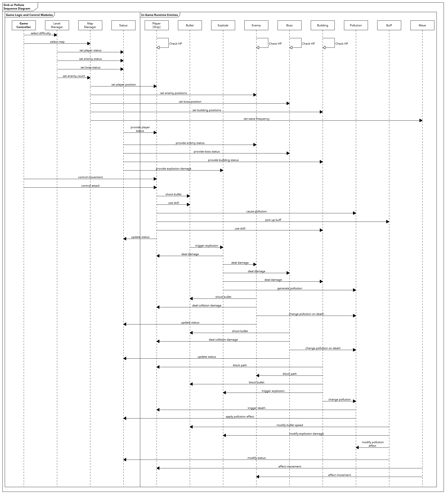

# 2025-group-18

## 🚢🌊♻️ - Sink or Pollute

  <a href="https://uob-comsm0166.github.io/2025-group-18/" style="font-size: 25px; font-weight: bold;">🖱️ Game Demo</a>

<b>Live Demo</b>

    <video src="https://github.com/user-attachments/assets/87385110-d520-4592-b841-c3bcf2562638" controls width="600"></video>

    
 <strong>Full Game Video</strong> 

    

>  [!IMPORTANT] 
>
> Our team previously developed and modified code in this [📦 GitHub repository](https://github.com/qtyohh/Plan-Roguelike-Knight)

## 👥 Our Group

| 🙋‍♂️ Name | 📧 Email | 💻 GithubID | 🛠️ Role | ✅ Completed Work |
| :-: | :-: | :-: | :-: | :-: |
| Tianyu Qi | yn24649@bristol.ac.uk | qtyohh | Game Designer | Scrum Master / System Design / Game & Balance Design |
| Likun Liang | oy24839@bristol.ac.uk | lycorisadiata | Developer | UIs / Pet / Equipment / Enemy / QA |
| Yutong Liu | xm24685@bristol.ac.uk | WILLOW579 | Animation Designer | Character & Motion & Narrative Design |
| Zihao Xia | qh24613@bristol.ac.uk | WeirdDruid | Developer | enemyAI / Boss / MapUI / Bullet / QA |
| Guanglong Xia | iu24606@bristol.ac.uk | X-Theodore | Project Manager | [Click here](docs/labprocess/last/DevelopmentContributions.md) |
| Jinglong Xiao | qo24236@bristol.ac.uk | yusheng2077 | Developer | Buff / Translation / Video |

## Kanban link

> [🧩 Board · 2025-Group-18](https://github.com/orgs/UoB-COMSM0166/projects/129)

## Weekly work

### Week 01

1. [📊 Research game](docs/labprocess/week01/research-game.xlsx)
2. [📝 A list of inspiration (including game mechanics)](docs/labprocess/week01/Game-mechanics-example.docx)
3. [📝 Game ideas](docs/labprocess/week01/Inspiration-of-Knight.docx)

### Week 02

1. [🖱️ Paint Work](https://uoB-COMSM0166.github.io/2025-group-18/labprocess/week02/paint/)
2. [📜 Two game ideas](docs/labprocess/week02/Two-Game-Ideas.md)

### Week 03

1. [🎥 Paper Prototype](docs/labprocess/week03/idea2.mp4)
   
    

      <video src="https://github.com/user-attachments/assets/f10a8343-5c8b-4841-b726-3268efc43926" controls width="600"></video>
    

    
    
    
2. <a href="docs/labprocess/week03/DigitalWireframe.gif" target="_blank">🎞️ Digital wireframe</a>
3. [📜 Additional requirements](docs/labprocess/week03/AdditionalRequirements.md)

### Week 04

1. [📜 Requirements section](docs/labprocess/week04/Epic.md)
2. [📜 Feedback section](docs/labprocess/week04/Feedback.md)
3. [🧩 Onion Model of Stakeholders](docs/labprocess/week04/Onion%20Model%20of%20Stakeholders.png)

### Week 05
1. [🧩 Class Diagram](docs/labprocess/week05/ClassDiagram.png)
2. [🧩 Sequence Diagram](docs/labprocess/week05/SequenceDiagram.png)

### Week 06 (Reading week - nothing need)

### Week 07

1. [📊 Heuristic Evaluation](docs/labprocess/week07/heuristic-evaluation.md)

### Week 08
1. [📜 Three Challenges](docs/labprocess/week08/three-challenges.md)
2. [📊 User Evaluations (SUS & NASA-TLX)](docs/labprocess/week08/user-evaluations.md)

## Project Report

### 1. Introduction

- Game background
  - In the early 22nd century, tech changes and science made pollution worse. Climate change caused sea levels to rise, and land became very little. Lack of resources and bad environment made problems worse. Humans had to fight pollution monsters and look for survival resources in ocean storms.
  
- Game  mechanics
  - This game has a highly replayable roguelike core loop. Every run gives new strategy choices. Key features include randomly generated levels, many random events, weapon and skill combos, growing difficulty, and a reward-punishment system. Each run brings new challenges and chances.
  - Players go through a loop of "start - explore - fight - choose - die/win - move on/restart." They get stronger, unlock new stuff, and explore more strategies. The game aims to give intense battles and make players feel fun and achievement through trying and growing.
- Game innovation:
  - A roguelike shooting survival game where every play is different. Players fight, survive, and plan in random environments. The game offers many weapon, skill, and pet combos, plus resource collecting and upgrades to grow stronger in tough battles.
  - A dynamic weather system changes the gameplay. Big storms can change your route, ocean currents affect your speed, and strange sea events bring new threats. Players must adapt to harsh weather and change tactics to survive and fight well.
  - A pollution system changes with player and enemy actions. It affects the ecosystem, resources, and enemy power. High pollution can cause mutant creatures, lower resources, and speed up ocean decay. Lowering pollution can unlock tech upgrades and ally support. Players can clean the environment for long-term gains or use the chaos from pollution as a tactic.

---

### 2. Requirements

#### 2.1 Identifying Stakeholders

	

#### 2.2 Epic

| Bot                      | User Story                                                                                                                                                 | Acceptance Criteria                                                                                                                                                                                               |
| ------------------------- | --------------------------------------------------------------------------------------------------------------------------------------------------------- | ----------------------------------------------------------------------------------------------------------------------------------------------------------------------------------------------------------------- |
| Action Shooter Enthusiast  | As an action shooter game enthusiast, I have a lot of time recently, but most action shooters are too repetitive. I want to play a game that includes more randomness. | 1. Enemies, weapons, and battlefields are randomly generated in each session.   2. The difficulty of the game and the types of enemies dynamically adjust based on player progress.   3. The game has multiple random event triggers.   4. Players experience a different gameplay process each time.   5. There is a random mode where players can choose different challenges. |
| Rogue-like Enthusiast      | As a roguelike game enthusiast, I've played many roguelike games, but few of them incorporate battlefield changes as part of the strategy. I want to play a roguelike game that includes battlefield changes as part of the strategy. | 1. The battlefield changes dynamically based on game progress or player choices.   2. The battlefield changes affect player’s tactical decisions.   3. Players can alter the battlefield with specific skills or items.   4. Changing the battlefield requires players to weigh strategy and resource management.   5. Impact of battlefield changes is clearly communicated in the game. |
| Casual Gamer              | As a casual gamer, I’ve always wanted to try roguelike games, but the learning curve of games like *The Binding of Isaac* and *Slay the Spire* is too steep for me. I want the ability to customize the game difficulty so I can choose based on my gaming level. | 1. The game offers multiple difficulty settings.   2. The game includes tutorials to help new players understand the basic gameplay.   3. The game provides progressively unlocked difficulty options.   4. At lower difficulties, enemy attack strength and numbers are reduced.   5. The game provides clear progress tracking and feedback. |
| Game Auditor              | As a game auditor, I want the game to have a wider audience, so I need to minimize graphic violence. | 1. The game avoids excessive graphic violence, including bloody or gory scenes.   2. Combat effects can be represented through non-lethal means.   3. The game’s content complies with age classification standards.   4. The game avoids using vulgar language or visual effects.   5. If necessary, the game provides adjustable violence levels. |
| Colorblind Player          | As a colorblind player, I often find it difficult to distinguish between characters, items, etc., in fast-paced action games. I hope the game features elements with clear visual effects, such as different colored outlines. | 1. Each character, item, enemy, and other elements have clearly distinguishable marks (colored borders).   2. The game offers colorblind modes or customizable color options.   3. UI elements are designed with colorblind players in mind.   4. Environmental and combat elements are differentiated through shapes, textures, and other features.   5. The game offers visual effect options to adjust markers. |

#### 2.3 Early stages design

- Player Units:
  1. **Player Status:** HP, cooldown (for skills), buffs, attack power, damage bonus, move speed, pollution level
  2. **Weapons:** Type (melee, ranged), stats (blast radius, range, etc.)
  3. **Skills:** Single-target or area attack, cooldown, effect, skill upgrades (like number changes)
  4. **Equipment:** Type (armor, accessories), stats, effects, quantity limits (like consumables)
  5. **Summons:** Type (normal turret, laser turret, etc.), number, position, AI behavior, stats (HP, attack power)
- Enemy Units:
  1. **Enemy Status:** Type (normal, boss), HP, buffs, stats (damage, armor, etc.)
  2. **Weapons:** Types, stats (damage, range)
  3. **Skills(boss):** Unique skill sets, AI-controlled use (attacks, special moves)
  4. **Equipment:** Affects behavior or power (e.g., more armor, stronger attacks)
  5. **Special Cases:** Spawn location, power changes with progress, unique behavior (e.g., retreat when low HP)
- Neutral Units:
  1. **Interaction:** Players can interact (e.g., trading, quest giving, combat)
  2. **Other Functions:** Environmental impact (e.g., triggering events), NPC behaviors (e.g., healing, providing information)
- Environment:
  1. **Destructible Objects:** Interactive barriers, traps, walls that can be destroyed or altered by players (using weapons or skills)
  2. **Indestructible Objects:** Static obstacles that remain throughout gameplay (e.g., terrain, background scenery)
- User Interface & Interaction:
  1. **Reward System:** Rewards are given based on how well players do (like fighting skills, finishing quests). As players go further, rewards get better (like stronger items).
  2. **Other Interactive Elements:** Shops (use game money to buy stuff), Dialogue (choices matter), Events with decisions (moral or combat-related choices).
- Randomization & Procedural Elements:
  1. **Enemies:** Randomly picked from enemy types or preset boss list based on how far the player has progressed
  2. **Weapon Acquisition:** Enemies drop weapons randomly; similar weapons drop more often as you go further; better gear unlocks in stages
  3. **Attribute/Buff Enhancements:** Random or tier-based system (weak buffs early, strong buffs later)
  4. **Random Events:** Many types (like ambushes or discoveries); no back-to-back repeats; some events only happen after certain things are done

#### 2.4 The process of development and ideation

- At first, we planned to make a roguelike dungeon game, inspired by classics like *The Binding of Isaac* and *Soul Knight*. Based on that, we designed the main parts of the game and made early sketches to show the structure and art style (see below).

- But later, through team talks and trying things out, we found our game wasn’t new or fun enough. So we had several discussions to find ways to improve it, and finally chose to change the game’s setting and mechanics. After thinking it through, we moved the game to the open sea, letting players go on an ocean adventure in unknown waters.

  With this new idea, we updated the game’s early design, including ship models from different angles, concept art for the environment, and new gameplay systems (see below). This change gave our game a more unique theme and more creative space to build on.

<b>Player-Ship Design</b>

| **Vessel**                                                   | **Terrain**                                                  | **Multi-view**                                               |
| ------------------------------------------------------------ | ------------------------------------------------------------ | ------------------------------------------------------------ |
|  |  |  |

<b>Environment Design</b>

<b>Game GIF Design</b>

| Name | Preview | Type | Description |
|------|------|------|--------|
| Boss1 |  | boss | boss1 |
| Boss2 |  | boss | boss2 |
| Enemy1 |  | enemy | enemy1 |
| Enemy2 |  | enemy | enemy2 |
| Enemy3 |  | enemy | enemy3 |
| Enemy4 |  | enemy | enemy4 |
| Bird |  | orbiter | orbiter |
| Pollute-bucket |  | building | pollution |
| Tnt |  | building | tnt |

---

### 3. Design

Our game system comprises multiple modules:

| Module        | Class                                                                                                                        | Responsibilities                                                                                                                                                                                                                                                                   |
|---------------|------------------------------------------------------------------------------------------------------------------------------|------------------------------------------------------------------------------------------------------------------------------------------------------------------------------------------------------------------------------------------------------------------------------------|
| Main          | Main                                                                                                                         | Serves as the core game controller.  Initializes the game environment;  drives the main game loop and coordinates subsystems.                                                                                                                                                |
| Status        | Status Equipment Pollution                                                                                             | Centralizes management of dynamic player attributes (HP/attack power/speed, etc.);  tracks pollution values and environmental impact parameters;  provides APIs for the Buff system to modify attributes;  implements attribute persistence storage.                      |
| Object        | BasicObject Building Island LivingObject Player Enemy Boss Bullet Pet Wave AoeSkill Explode | Defines base class (BasicObject) for all game entities;  LivingObject implements shared traits (HP/size/speed, etc);  Player/Enemy/Boss implement specific behavior trees;  Bullet manages projectile trajectories;  AoeSkill and Explode implement area-effect logic. |
| Game          | Game                                                                                                                         | Manages the lifecycle of a single level (start/in-progress/end);  loads level configurations;  controls enemy wave generation;  evaluates win/loss conditions;  maintains level-specific object pools.                                                                 |
| PlayerControl | PlayerControl                                                                                                                | Captures input events (keyboard/mouse);  parses commands (movement/attack/skills);  handles targeting logic for attacks;  manages skill cooldowns and attack cooldown.                                                                                                    |
| Buffs         | Buff BuffController                                                                                                       | Implements buff management systems; dynamically modifies player attributes (e.g., attack power).                                                                                                                                                                                   |

#### 3.1 Class Diagram

This class diagram serves as the blueprint for game development, using intuitive visuals to showcase core functional modules and their interconnections. It functions as a shared technical roadmap for the team, enabling developers to quickly grasp system operations, identify counterproductive dependencies between modules, and guide logical code organization through clear interface specifications. This structural framework makes future feature upgrades and content expansions as flexible and modular as building with interlocking blocks.

#### 3.2 Behavioural Diagram

The `Main` class works as the game controller. It handles all the initial setups and manages the main parts of the game, such as `MainUI`, `Game`, `PlayerControl`, and `Status`. You can think of it as the brain of the game that keeps everything running correctly.

After the game starts, `MainUI` sets up all the user interface (UI) parts and puts them into the UI system for players to use. At this point, `StartUI` becomes ready, and the game can begin. Then, `ChooseShipUI` lets players pick a difficulty level and map. This also sets the ship(`Player`) starting stats and conditions.

Once the map is ready, `MapUI` shows several buttons and lines connecting them. Players can click a button (called a node) to start a battle or `trigger` an event. `ShopUI` also appears on the map. In the shop, players can `recover` HP, `increase` more bullets, or buy other useful items.

During the battle, `InGameUI` takes control. Players can `move` their ship, `shoot` bullets, use `skills`, and dodge enemies or obstacles. Some objects like `Building`s or `Wave`s may also block your `Movement`. `Enemies` will come, and sometimes a `boss` (a stronger enemy) appears. Players need to keep an eye on their HP and the pollution level. These values are updated in real time by a function called `updateStatus`.

At the end of each round, players get a `Buff` as a reward. This Buff might increase bullet speed, add extra bullets, boost damage, or lower pollution. After choosing a Buff, players return to `MapUI` and continue exploring.

When players fight the boss, the result decides what happens next. If the player wins, the game moves on to the next `loop` with harder enemies or a new event. If the player dies, the `Status` resets and the game restarts.

The whole process of updating status and switching between levels is managed by the `Game` class. It keeps everything in sync and makes sure the game looks and feels consistent every time a change happens.

---

### 4. Implementation

#### 4.1 Our implementation

Our system is mainly divided into five parts: PlayerControl, Status, Object, Buffs, and UI.

- **PlayerControl** part manages player actions, including movement, hit feedback, and skills.
- **Status** is used to store and call player data.
- **Object** defines all in-game entities, which are divided into LivingObject and StillObject, covering player classes, enemy classes, building classes, and more.
- **Buffs** manages the creation, application, and removal of all buffs in the game.
- **UI** part builds the entire visual layout, including StartUI, MapUI, InGameUI, and 16 other UI designs.

#### 4.2 Challenge

1. **Loop and Randomness**
    **Description:**
   In order to deepen our game's laybners and enhance the player experience, we have the map reset on every run and our algorithm permanently increases all enemies' health and speed; at the same time, procedurally generated maps, events, and buffs ensure that each new loop is more challenging and exciting. This poses two challenges for our looping randomness.

   **Solution:**
    Each loop resets the map and permanently buffs all enemies—intensifying both the challenge and the thrill—while nine procedural map templates, each with dynamic layouts and unique enemy placements, keep exploration unpredictable. On top of that, fifteen route-triggered events—from blaring sirens to noxious pollution—force you into high-risk, high-reward decisions that can make or break your quest. To help you adapt, you can also pick up buffs from shops, combat victories, and event rewards, ensuring every run feels fresh, strategic, and exhilarating.

2. **Game Performance Optimization**
    **Description:**
    To improve gameplay experience, some maps in our game originally had many objects including numerous islands, buildings, enemies, and bullets. This caused serious frame rate drop. 

   **Solution:**
    We used Chrome browser's built-in DevTools to systematically analyze the issue. By observing the Flame Chart, we found that the image calling function had the biggest negative impact on performance. We specifically optimized how textures were called, which eliminated the lagging problem.

3. **Automatic Full-Window Size Adaptation**
    **Description:**
    To provide consistent gameplay experience for players using different display devices, we wanted our game to automatically adjust its display size according to the window dimensions. In the initial version, our game would read the window size, change pixel sizes of in-game objects accordingly, and map mouse coordinates to the adjusted dimensions. However, this approach required scaling calculations for object sizes and attributes like movement speeds of enemies, players, and bullets. This greatly increased development difficulty and caused many bugs.

   **Solution:**
    To solve this, we added a fixed-size logical canvas. First, all game elements are drawn onto this logical canvas, then the canvas is scaled proportionally to fit the browser window size.

---

### 5. Evaluation

#### 5.1 Heuristic Evaluation:  *Sink or Pollute*

##### 5.1.1 Data Table
| Interface | Issue | Heuristic(s) | Frequency (0-4) | Impact (0-4) | Persistence (0-4) | Severity (F+I+P)/3 |
|-----------|------|-------------|-----------------|-------------|----------------|------------------|
| **Game play** | No pause option, leading to player fatigue in long sessions | User Control and Freedom | 4 | 2 | 4 | 3.33 |
| **Enemy AI** | Enemies freeze when out of player vision, making combat less engaging | Consistency and Standards | 3 | 4 | 3 | 3.33 |
| **Level Design** | Lack of path choices reduces exploration, which is essential in roguelike games | Flexibility and Efficiency of Use | 1 | 1 | 2 | 1.33 |
| **Visual Feedback** | Character, enemy, and bullet sizes lack clear contrast, making it difficult for players to track action | Visibility of System Status | 3 | 4 | 4 | 3.67 |
| **UI/UX** | No skill cooldown feedback, making ability timing difficult | Visibility of System Status | 3 | 3 | 3 | 3.00 |
| **Collision Detection** | Invisible walls near islands and enemies, leading to frustrating movement constraints | Error Prevention | 3 | 4 | 4 | 3.67 |

##### 5.1.2 Solutions
- **Game play** (implemented) – Although in-level pausing is still unavailable, we shortened each combat encounter and lengthened the overall tower climb. This keeps battles punchy while preserving total playtime and challenge.
- **Enemy AI** (implemented) – Enemies now have a vision system. When the player is off-screen they wander with light randomness; once the player is detected, melee and ranged units use distinct pursuit behaviours to maintain pressure.
- **Visual Feedback** (implemented) – Player, enemy, and map elements use high-contrast palettes that stand out sharply against the background, making threats instantly readable.
- **UI/UX** (implemented) – Skill-cooldown cues are larger and animated, so timing abilities no longer relies on memory.
- **Collision Detection** (implemented) – Collider shapes were retuned for smoother sliding along terrain, and enemy bodies no longer hard-block the player, virtually eliminating “stuck” moments.

#### 5.2 Usability Evaluation: NASA-TLX

**Data:**

| User    | NASA-TLX Easy Mode | NASA-TLX Hard Mode |
|---------|------------------|------------------|
| User 01 | 28.3             | 66.7             |
| User 02 | 30.0             | 72.5             |
| User 03 | 25.0             | 65.0             |
| User 04 | 28.3             | 75.0             |
| User 05 | 22.5             | 68.3             |
| User 06 | 32.5             | 80.0             |
| User 07 | 20.0             | 70.8             |
| User 08 | 35.0             | 77.5             |
| User 09 | 27.5             | 66.7             |
| User 10 | 24.2             | 73.3             |

**NASA-TLX Analysis**
- **Easy Mode Average Workload**: **27.3**
- **Hard Mode Average Workload**: **71.6**

Test used
Because each of the 10 participants provided paired NASA-TLX scores for both conditions, the non-parametric **Wilcoxon signed-rank test** (two-tailed) was applied to compare Easy vs. Hard modes.

| Statistic |	Value |
| --- | --- |
| n (pairs) | 10 |
| Exact p-value | 0.00195 << 0.05 |
| Median (Easy) | 27.9 |
| Median (Hard) | 71.7 |
| Rank-biserial effect size r | 0.89 (large) |

**Interpretation**
- The Wilcoxon signed-rank test revealed a significant increase in perceived workload from Easy mode to Hard mode, **p = 0.002**. 
- All ten participants rated Hard mode higher than Easy mode, and the large effect size (r = 0.89) indicates a substantial practical difference. Thus, the Hard mode imposes a markedly greater mental and physical workload on users.
- Higher NASA-TLX scores indicate greater perceived workload. The **Hard Mode** had significantly higher workload ratings, indicating that users found it more mentally and physically demanding.

#### Testing 

##### Why we choose Black-Box testing rather than White-Box
- High Setup & Maintenance Overhead
- Limited Fault Detection Beyond Black-Box Scenarios
- Redundant Coverage & Diminishing Returns

##### Black-Box testing
- In our p5.js project, black-box testing is woven directly into the rhythm of our **short Scrum sprints** and **continuous-integration pipeline**. 
- Each developer works on a personal Git feature branch; while the code is still isolated, they launch the game in a browser and play through the fresh content exactly as a player would, looking for crashes, visual glitches, timing mistakes, or anything that feels wrong. 
- Other **teammates** also get the chance to play and test and give a feedback.
- The branch is pushed only after these ad-hoc play-throughs confirm that the new mechanic coexists peacefully with the existing systems. 
- When a branch finally merges into main, we know that whole team play-testing has signed off, so the trunk stays deployable and bug-free sprint after sprint.

---

### 6. Process

Teamwork was essential to our game development process. Our team consisted of six members, each responsible for specific tasks to make the work more efficient and organized.

#### 6.1 Team Roles and Responsibilities:

We divided the roles based on each member’s skills and interests.

- **PlayerControl & Mechanics**: One member handled the design and implementation of player actions, such as movement, hit feedback, and skills. This ensured that the player could interact smoothly with the game world.
- **Status & Data Management**: Another member worked on the Status system. They were responsible for storing and retrieving player data, making sure everything was managed properly throughout the game.
- **Object & Entity Management**: One team member was in charge of defining game entities like players and enemies. They also worked on how these entities interact in the game.
- **Buffs System**: A team member focused on managing buffs in the game, making sure that buffs were triggered, applied, and removed smoothly, without affecting other mechanics.
- **UI Design**: Two members worked on the game’s interface, designing screens like StartUI, MapUI, and InGameUI. They made sure the UI was consistent and visually appealing.
- **Animation Design**: One member was responsible for designing and creating animated sprites for the game’s various entities. This added life and dynamic visual effects to the characters and objects in the game.

#### 6.2 Tools and Collaboration:

We used several tools to make our work easier and to collaborate effectively.

- **Version Control**: We used Git to manage our project. This helped us keep track of changes, resolve conflicts, and ensure everyone was working on the latest version of the project.
- **Communication**: We used Kanban for daily communication and met face-to-face once a week for check-ins. This allowed us to share updates, discuss problems, and make decisions together.
- **Game Engine & Development Tools**: We used P5.JS as our game engine and VS Code for coding. These tools made it easier for us to implement the game’s features.
- **Photoshop**: Photoshop was used for designing and creating game assets like character sprites, backgrounds, and other graphical elements. This allowed us to have high-quality visuals in the game.

#### 6.3 Working Together:

Working as a team was key to overcoming challenges. We regularly held meetings to talk about our progress, solve problems, and share ideas. Whenever an issue came up, like optimizing the pollution system or fixing performance problems, we worked together to find the best solution.

For example, we faced lag and frame drops due to the animated effects we used for the entities. To fix this, we discussed different optimization strategies as a team. After trying a few solutions, we found one that improved performance while keeping the quality of the animations. This experience taught us a lot about problem-solving as a team and how to tackle similar issues in the future.

---

### 7. Sustainability, ethics and accessibility

#### 7.1 Environmental Impact:

As game developers, we recognize that our work has an environmental impact, even if it's not as obvious as physical products. Games contribute to energy consumption, e-waste, and carbon emissions. To minimize these effects, we implemented several strategies in the development of our game.

1. **Energy-Efficient Development:**
    We used cloud-based tools to collaborate and store files, reducing the need for physical travel and saving energy. This helped keep our carbon footprint low while still allowing our team to work efficiently from different locations.
2. **Optimized Game Performance:**
    We made sure our game runs smoothly on lower-end hardware. This helps reduce the need for players to upgrade their devices, lowering e-waste and extending the lifespan of older hardware. We also optimized the game’s code and assets to use less processing power, which helps save energy during gameplay.
3. **Environmental Awareness in Gameplay:**
    The game’s theme focuses on pollution and environmental challenges. The dynamic pollution system in the game serves as a reflection of real-world environmental issues. By including these themes, we hope to raise awareness and encourage players to think about pollution and resource conservation in real life.

#### 7.2 Social Impact:

Games can influence society in many ways, both positively and negatively. Our goal was to make a game that promotes positive social interactions and reflects a variety of perspectives.

1. **Promoting Teamwork:**
    Our game encourages cooperation, especially in multiplayer modes. Players must work together to achieve common goals, fostering teamwork and communication. These skills are valuable in both gaming and real-world situations, helping players build social connections.
2. **Diverse Representation:**
    We made sure to include a range of characters in the game, representing different genders and ethnicities. This allows players from various backgrounds to feel included and seen. Diverse representation can break down stereotypes and make the game more relatable to a wider audience.
3. **Mental Health Awareness:**
    We incorporated gameplay elements that subtly touch on mental health issues. For example, certain in-game challenges can affect the character's mental state, prompting players to reflect on their own well-being. By including these themes, we hope to raise awareness about the importance of mental health and self-care.

#### 7.3 Technical Impact:

Technology plays a big role in how we create and experience games. We focused on making our game both technically innovative and accessible to a wide audience.

1. **Efficient Coding:**
    We optimized the game’s code to ensure it runs well on a variety of devices. By making sure the game can run on lower-end hardware, we made it accessible to more players, without requiring them to upgrade their devices. This also helps reduce energy consumption during gameplay.
2. **Procedural Generation and AI:**
    We used procedural generation techniques to create dynamic and unpredictable game worlds. This makes the game feel fresh every time a player plays it. Additionally, we used AI to create enemies with adaptive behaviors, increasing the challenge and keeping the game interesting.
3. **Focus on Accessibility:**
    Accessibility was a key consideration in our game. We included features like customizable controls, colorblind mode, and adjustable difficulty levels to make the game enjoyable for players with different abilities. These features help ensure that the game is accessible to a broad audience, allowing everyone to enjoy it.

---

### 8. Conclusion

Looking back on our project, it has been a rewarding experience. We started with basic ideas and turned them into a real game. Throughout the process, we faced challenges, learned valuable lessons, and worked as a team to make the game better.

#### 8.1 Lessons Learned:

The most important lesson we learned was the power of teamwork and clear communication. At the beginning, we struggled with dividing tasks and organizing work. Once we assigned specific roles to each team member, the project moved much more smoothly. Each person could focus on their area of expertise, which helped us stay on track. We also learned how important it is to test and get feedback from others. Early in the process, we had many ideas, but we had to refine them after testing to make sure the game was fun and balanced. Feedback helped us improve the gameplay, and we learned to adjust things like difficulty and game mechanics.

Another key lesson was the importance of working in small steps and improving over time. Instead of trying to create everything at once, we took small actions, tested them, and made changes as needed. This approach allowed us to improve the game gradually.

#### 8.2 Challenges Faced:

One of the biggest challenge was improving game performance, especially when many animated entities were on screen. This caused the game to lag and have frame rate drops. To solve this, we optimized the way the game loaded and rendered entities. We introduced caching and improved how entities were updated. This helped make the game run more smoothly.

Another challenge was implementing dynamic window scaling. We wanted the game to adapt seamlessly to different display sizes without compromising visual fidelity. Initially, we attempted direct pixel-based resizing of game elements and mouse coordinate mapping, but this led to complex scaling calculations and frequent bugs. We solved this by introducing a fixed logical canvas where all elements are first rendered, then proportionally scaled to fit the browser window. This approach eliminated per-frame size calculations while maintaining consistent gameplay proportions.

#### 8.3 Future Work:

There is still a lot to do. One of our main goals is to add a multi-player mode. Right now, the game is single-player, but adding multiplayer will bring new challenges and make the game more fun and interactive. Players will be able to work together, share resources, and face challenges as a team.

We also want to expand the environmental system. The pollution system is just the beginning. We plan to add more environmental factors, like changing weather and evolving ecosystems, that will affect the gameplay. This will make the game even more challenging and engaging.

We also aim to improve player mechanics and weapons. There are plenty of ideas for new weapons, abilities, and strategic options that we want to include. This will give players more variety and control over their gameplay. Additionally, we plan to improve the game’s UI and visuals to make it more enjoyable and immersive.

In conclusion, while we’ve made great progress, the game is still a work in progress. We’ve learned a lot, and each challenge has helped us improve. We are excited about the future of the project and look forward to making it even better with new features and improvements.

---

### 9. Contribution Statement

| Name | Contribution | Weight |
|:-----|:-------------|:------:|
| Tianyu Qi | System & Game & Balance Design | 1 |
| Likun Liang | UI & Develop & QA | 1 |
| Yutong Liu | Animation Design | 1 |
| Zihao Xia | UI & Develop & QA | 1 |
| Guanglong Xia | [Click here](docs/labprocess/last/DevelopmentContributions.md) | 1 |
| Jinglong Xiao | Buff & Translation & Video | 1 |

